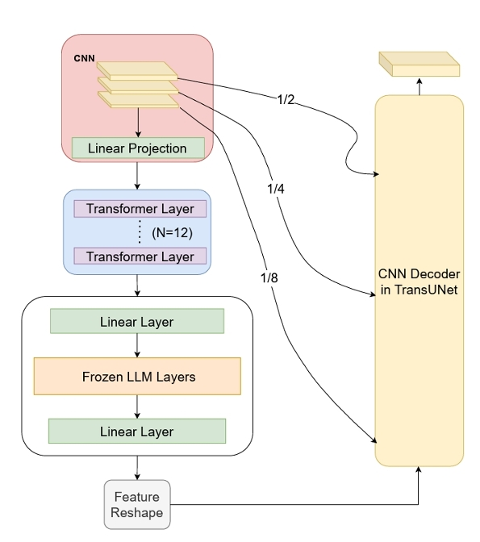

# LLM-TransUNet
Official PyTorch implementation of the paper [Can Frozen Transformers in Large Language Models Help with Medical Image Segmentation?](https://openreview.net/forum?id=JOwJe2DGp4), which is published a s a short paper at MIDL2024.

## Architecture
<p align="center">

</p>


## Usage
### 1. Prepare data

Synapse (BTCV preprocessed data) and ACDC data are available at TransUNet's repo (https://github.com/Beckschen/TransUNet/tree/main). 

The directory structure of the whole project is as follows:

```
.
├── LLM4MedSeg
│   ├──datasets
│   │       └── dataset_*.py
│   ├──train.py
│   ├──test.py
│   ├──...
│   └──data
│        └── Synapse
│        │        ├── test_vol_h5
│        │        │   ├── case0001.npy.h5
│        │        │   └── *.npy.h5
│        │        └── train_npz
│        │          ├── case0005_slice000.npz
│        │          └── *.npz
│        │
│        └──ACDC
│             ├── ACDC_training_volumes
│             │      ├── patient100_frame01.h5
│             │      └── *.h5
│             └── ACDC_training_slices
│                    ├── patient100_frame13_slice_0.h5
│                    └── *.h5   

```
### 2. Environment

Please prepare an environment with python=3.9, and then use the command "pip install -r requirements.txt" for the dependencies.

### 3. Download weights

Download LLaMA-7B checkpoints and put them into the folder named "LLaMA". The contents in the directory should contains things like: checklist.chk, consolidated.00.pth, and params.json.


### 4. Train/Test

- Run the train script on synapse dataset. The batch size can be reduced to 12 or 6 to save memory (please also decrease the base_lr linearly), and both can reach similar performance.

```bash
CUDA_VISIBLE_DEVICES=0 python train.py --dataset Synapse --vit_name R50-ViT-B_16
```

- Run the test script on synapse dataset.

```bash
python test.py --dataset Synapse --vit_name R50-ViT-B_16
```

## Citations

``` 
@inproceedings{jiang2024can,
  title={Can Frozen Transformer in Large Language Model Help with Medical Image Segmentaion?},
  author={Jiang, Juntao and Liu, Yong},
  booktitle={Medical Imaging with Deep Learning},
  year={2024}
}
